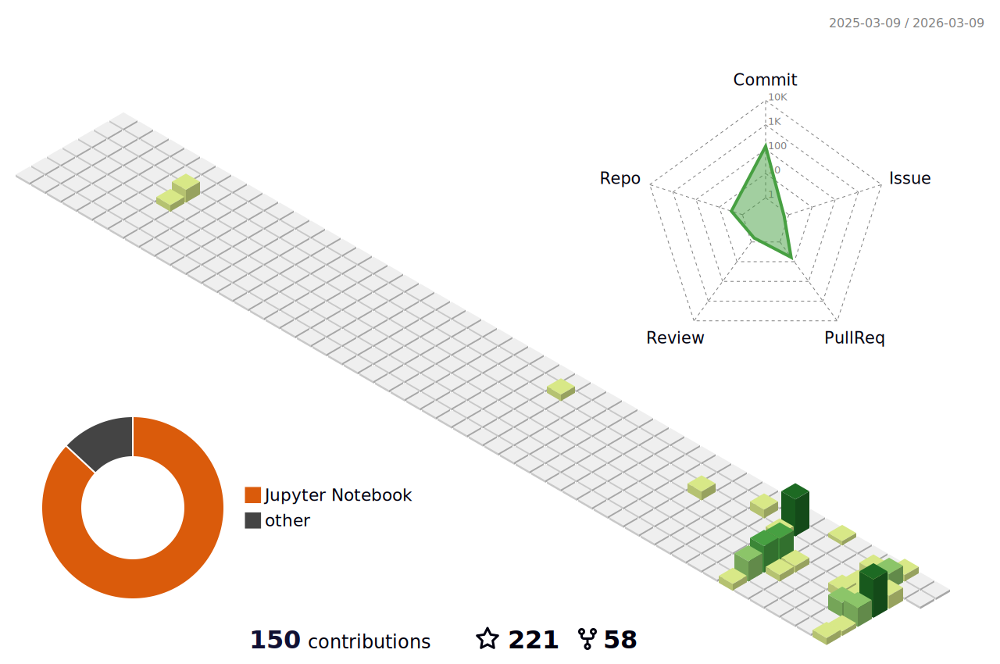

  

  

# 🎯 About Me :

Hello, I am Zeyad El-Sayed, I am machine learning engineer, I am a student at the Faculty of Computer and Artificial Intelligence, Benha University. I am interested in artificial intelligence and software engineering. I am a fast learner and love programming, coding, math and techniques.

<!--social media-->

 
  

  
  
  
 

# 🚀 Languages and Tools:

  
  
  
  

<!--3d ani-->

# 📈  Stats:
 

   
  
  
  

 

<!--snake-->

  

## 📞 Contact :

  
  
 

<a href="https://www.linkedin.com/in/zeyadusf/" target="_blank">
  

  

  

  

